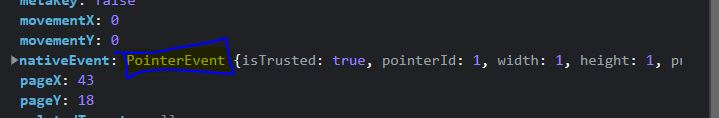
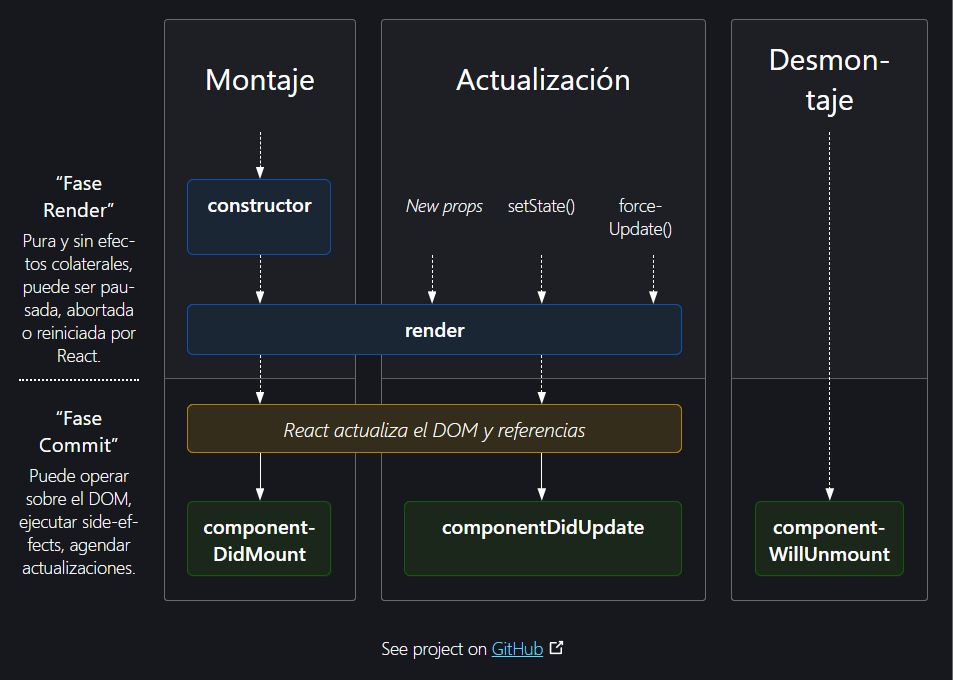

# **COMANDOS**

## **PRIMEROS PASOS**
## **Configuracion**
> Links necesarios para insertar dentro de un archivo html y usar React(se obtine de https://legacy.reactjs.org/docs/cdn-links.html):
```html
<script crossorigin src="https://unpkg.com/react@18/umd/react.development.js"></script>
<script crossorigin src="https://unpkg.com/react-dom@18/umd/react-dom.development.js"></script>
```

> Links necesarios para tuilizar JSX dentro de html (se obtienen del siguiente link: https://babeljs.io/docs/babel-standalone)

```html
<script src="https://unpkg.com/@babel/standalone/babel.min.js"></script>
```

## **JSX**
> Crear una variable, escribiento etiquetas en html:
```jsx
<!DOCTYPE html>
<html lang="en">
<head>
    <meta charset="UTF-8">
    <meta name="viewport" content="width=device-width, initial-scale=1.0">
    <title>Prueba JSX</title>
    <script crossorigin src="https://unpkg.com/react@18/umd/react.development.js"></script>
    <script crossorigin src="https://unpkg.com/react-dom@18/umd/react-dom.development.js"></script>
    <script src="https://unpkg.com/@babel/standalone/babel.min.js"></script>
</head>
<body>
    <div id="root">

    </div>
    <script type="text/babel">
        const usuario = {
            name: 'Julio',
            edad: 25
        };
        let h1 = <h1 class='saludo'>Hello Misael!</h1>;
        ReactDOM.render(h1,document.getElementById('root'));
    </script>
</body>
</html>
```

> Usar sintaxys JavaScript en JSX:
```jsx
const usuario = {
    name: 'Julio',
    apellido: 'Ramirez',
    edad: 25
};

let h1 = <h1 class='saludo'>Hello {usuario.name}!</h1>; // Se utiliza {} si queremos utilizar java script dentro de una etiqueta 
ReactDOM.render(h1,document.getElementById('root'));
```

> Llamar una funcion en JSX dentro de una etiqueta:
```jsx
const usuario = {
name: 'Julio',
apellido: 'Ramirez',
edad: 25,
nickName: 'MichDroid'
};

function crearNombreCompleto (usuario) {
    return usuario.name + ' ' + usuario.apellido;
}

let obtenerUsuario = (usuario) => {
    return usuario.nickName;
};
let h1 = <h1 class={obtenerUsuario(usuario)}>Hello {crearNombreCompleto(usuario)}!</h1>; // Se utiliza {} si queremos utilizar java script dentro de una etiqueta 
ReactDOM.render(h1,document.getElementById('root'));
```

> Como convertir lenguaje de JSX a JavaScript Puro con ayuda de babel. Para esto nos vamos a babel compiler dentro de google y utlizamos la herramienta, asiendo la comversion tenemos que: 
```jsx
    let h1 = <h1 class='saludo'>Hello Misael!</h1>;
        ReactDOM.render(h1,document.getElementById('root'));
```
es igual a:

```js
let h1 = /*#__PURE__*/React.createElement("h1", {class: "saludo"}, "Hello Misael!");
ReactDOM.render(h1, document.getElementById('root'));
```

> Haciendo la conversion de lenguaje JSX a JAVASCRIPT corriendo BABEL localmente:
1. Abrimos una terminal en VSCODE.
2. Iniciamos npm init. Esto crea un archivo de package.json.
3. Instalamos BABEL. Utilizamos el siguiente comando `npm install babel-cli@6 babel-preset-react-app@3` DOnde `babel-cli@6`: Es la linea de interfaz de linea de comando para BABEL, ``babel-preset-react-app@3`: Es un pluggin para REACT para hacer esa transformacion de JSX a JS. Esto va a generar 2 dependencias en el archivo package.json -> `babel-cli: "^6.26.0"` y `"babel-preset-react-app": "3.1.2"`. Asi tambien se crea la carpeta `node.modules` que va a venir con el compilador.
4. Compilamos el archivo `jsx.j`. Escribimos en consola -> `npx babel --watch 01\ Primeros\ Pasos/jsx/ --out-dir dist --presets react-app/prod`. Donde `npx babel`
: Indica que ejecutaremos babel, `--watch`: Nos indica que observara el archivo y nos notificara cuando exista una modificacion, `01\ Primeros\ Pasos/jsx/`: La ruta donde estan los archivos, en este caso jsx, el cuala van a observarse y se van a compilar,  `--out-dir`: Nos indica que posteriormente indicaremos donde se guardaran los archivos creados, en este caso, se creara la carpte dist, `dist`: Nombre de la carpeta `--presets`: Nos indica que posteriormente mencionaremos el preset que utilizaremos, `react-app/prod`: Nombre del preset.
5. Por ultimo de creara un archivo .js con el mismo nombre pero en lenguaje JAVASCRIPT dentro de la carpeta destino, en este caso dist. 
**NOTA**: babel puede transformar un archivo .js con lengujae JSX a un archivo .js con lenguaje JAVASCRIPT 

## **COMPONENTES**
## **Componentes con funciones**
En REACT hay dos formas de crear componentes: 
1. Por medio de funciones.
2. Por medio de clases.

> Creando un componente: 
```jsx
function Saludo () { // Los componentes se nombrar iniciando con Mayusculas
    return <h1>Welcome Home!</h1> // Siempre se retorna la etiqueta. 
}

let h1 = Saludo();

ReactDOM.render(h1, document.getElementById('root'));
// Tambien podemos hacer lo siguiente para renderisar: 
//ReactDOM.render(<Saludo />, document.getElementById('root'));
// <Saludo /> - > Es una etiqueta llamando la funcion Saludo
```

> Creando una mini aplicaicon:
```jsx
function Saludo () {
    return <h1>Hello World!</h1>;
};

function App () {
    return (
        <div>
            <Saludo />
            <Saludo />
            <Saludo />
        </div>
    ); // El Parentesis no indicara que seran varias etiquetas. 
}

ReactDOM.render(<App />, document.getElementById('root'))
```

> Reto: 


Solucion: 
```jsx
function Previa () {
    return (
        <div class='principal'>
            <div>
                
            </div>
            <div>
                <svg></svg>
                <h2>95% de coincidencia</h2>
                <h2>2004</h2>
            </div>
            <div>
                <p></p>
            </div>

        </div>
    );
}
```

## **Propiedades**
> Agregar atributos cuando se mandan a llamar a las funciones con etiquetas < NombreDeFuncion />

```jsx
function Saludo (props) { // Para obtener propiedades como atributos de una etiqueta se utliza la palabra props.
    return <h1>Hello {props.name} {props.apellido}</h1>
}

function App () {
    return (
        <div>
            <Saludo name="Misael" apellido="Ramirez"/>
            <Saludo name="Jencita" apellido="Lopez"/>
            <Saludo name="Sonia" apellido="Cortes"/>
        </div>
    );
}

ReactDOM.render(<App />, document.getElementById('root'));
```

> Crear un aaplicacion con formulario:
```jsx
function Saludo (props) { // Para obtener propiedades como atributos de una etiqueta se utliza la palabra props.
    return <h1>Hello {props.name} {props.apellido}</h1>
}

function Login (props) {
    return (
        <form action="/action.php" method="POST">
            <label for="name" >Nombre</label>
            <input id="name" name="name" value={props.name}></input>
            <br />
            <br />
            <label>
                Email
                <input name="email" type="email" required placeholder="misael.360@ejemplo.com"></input>
            </label>
            <br />
            <br />
            <button>Iniciar Sesion</button>
        </form>
    );
}

function App () {
    return (
        <div>
            <Saludo name="Misael" apellido="Ramirez" />
            <Login name="Jencita" />
        </div>
    );
}

ReactDOM.render(<App />, document.getElementById('root'));
```
Nosotros podriamos crear nuestro propios componente y utilizarlos. Incluso, existen librerias de react en  `Material UI .com` en el cual podemos utilizar en nuestro proyectos. 

> Reto:


```jsx
let nombre = 'Jenniffer';
let grupo = 'Ventas El Molino';


let Notificacion = (props) => {
    return (
        <div class='contenedor'>
            <a href='#'>
                <div>
                    
                </div>
                <div>
                    <span>
                        <b>{nombre}</b> te menciono en un comentario en <b>{grupo}</b>
                    </span>
                </div>
            </a>
        </div>
    );
};

let App = () => {
    return (
        <div>
            <Notificacion />
            <Notificacion />
            <Notificacion />
        </div>
    );    
};

ReactDOM.render(<App />, document.getElementById('root'));
```

## **Componentea con clasees***
El dia de hoy ya no se ocupan los componentes creados con clases. Todas las clase tienen un metodo que se llama render.
> Creando un componentes con clase: 
```jsx
class Bienvenido extends React.Component {
    render() {
        return <h1>Welcome {this.props.name}!</h1>
    }
}

ReactDOM.render(<Bienvenido name='Misael'/>, document.getElementById('root'));
```
A diferencia de los componentes con funciones estos componentes tienen ciclos de vida.

> Reto 3:


```jsx
class Nota extends React.Component {
    render() {
        return (
            <div class='contenedor'>
                <div class='titulo'>
                    <h1>{this.props.titulo}</h1>
                </div>
                <div class='contenido'>
                    <p>{this.props.contenido}</p>
                </div>
                <div class='hora'>
                    <p>
                        <b>{this.props.hora}</b>
                    </p>
                </div>
            </div>

        );
    }
}

ReactDOM.render(<Nota titulo='PASEAR AL PERRO' contenido='Pasear al perro de la vecina llamado Tomy' hora='17:00 hrs'/>, document.getElementById('root'));
```
## **Eventos en React**
> Crear un evento en react utilizando el atributo onclick='() => alert{"Alerta!"}' en html. En este caso, React reacciona a onclick de la siguiente manera `onClick`

```jsx
function Alertando (props) {
    let alerta = () => alert(props.mensaje);
    return <button onClick={alerta}>Click!</button>

}
// Definiendo un evento en componente clase
/*
class Alertando extends React.Component {
    render () {
        let alerta = () => alert(this.props.mensaje);
        return <button onClick={alerta}>Click!</button>
    }
}
*/

ReactDOM.render(<Alertando mensaje='Te Amo mucho, Jencita Bonita!!! <3'/>, document.getElementById('root'));

// Ahora
```

> Obtener el evento por medio de una variable, en este caso un evento de mouse:
```jsx
function Alertando (props) {
    let alerta = (e) => console.log("Alerta!", e); // Aqui esta la magia
    return <button onClick={alerta}>Click!</button>

}

ReactDOM.render(<Alertando mensaje='Te Amo mucho, Jencita Bonita!!! <3'/>, document.getElementById('root'));
```
La salida en consola es: 



> Reto:


```jsx
function cambiarCorreo () {

}

function cambiarClave () {

}


function Formulario () {

}
```

## **Estados**
Cada componente en React va a tener un estado.Por ejemplo el estado de un checkbox. Por ejemplo un input, cuando cambiamos syu estado al cambiar el valor dentro de el. 
> Estableciendo un HOOK:
```jsx
function Contador () {
    const [cuenta, setCuenta] = React.useState(0); // Inicializamos el state en 0

    return (
        <div>
              <h1>{cuenta}</h1>
              <input type='email'></input>
              <button onClick={() => {setCuenta(cuenta + 1)}}>Click!</button>
        </div>
    );
}

// Ahora, un gancho en componente de clase:
/*
class Contador extends React.Component {
    constructor (props) {
        super(props);
        this.state = {cuenta: 1}
    }
    
    render() {
        return (
            <div>
              <h1>{this.state.cuenta}</h1>
              <input type='email'></input>
              <button onClick={() => this.setState((state, props) => ({cuenta: state.cuenta + 1 }))}>Click!</button>
            </div>

        );

        
    }
}
*/

ReactDOM.render(<Contador/>, document.getElementById('root'))
```

>Reto: 


```jsx
function SelectorDeProducto () {
    const [producto, setProducto] = React.useState(0);

    const sumaProducto = () => {
        setProducto(producto + 1);
    }

    const restaProducto = () => {
        if(producto > 0){
            setProducto(producto - 1);
        }  
    }

    return (
        <div>
            <h1>{producto}</h1>
            <button class='botonResta' onClick={() => restaProducto()} >-</button>
            <button class='botonSuma'  onClick={() => sumaProducto()}>+</button>
        </div>
        
    );

}

ReactDOM.render(<SelectorDeProducto />, document.getElementById('root'));
```
## **Condicionales**
Se puede utilizar en logica como, si el usuario esta autorizado muestra este componente, si no esta autorizado mueestra este otro componente. Se puede utilizar esta logica para mostrar parte de la aplicacion solo a usuarios autorizados.

> Establecinedo un acondicion basica y comun:

```jsx
function Condicionales (props) {
    if (props.autorizado) return <h1>Bienvenido</h1> // props.autorizado ? true
    else return <h1>No Autorizado</h1>
}

ReactDOM.render(<Condicionales autorizado/>, document.getElementById('root'));
// Para ser no autorizado quitamos la propiedad y retorna No Autorizado.
// ReactDOM.render(<Condicionales />, document.getElementById('root'));
// Si simplemente definimos el nombre de la propiedad, se establece como que si autorizado fuese true. Por eso, el return retorna `Bienvenido`
```

> Simplificando el codigo anterior sin utilizar if y utilizando otro tipo de condicional:
```jsx
function Condicionales (props) {
    return props.autorizado ? <h1>Bienvenido</h1> : <h1>No Autorizado</h1>;
    // El comando anterior se lee: props.autorizado es true? Si si, se ejecuta ->
    // <h1>Bienvenido</h1> d elo contrario -> <h1>No Autorizado</h1>
} 

ReactDOM.render(<Condicionales autorizado/>, document.getElementById('root'));
```

> Haciendo que un componente retore nulo:

```jsx
function Condicionales (props) {
     return props.acceso ? <h1>Bienvenido</h1> : null;
    // Si quisieramos utilizar null, como en este caso, hay un truco dentro de javascript:
    // return props.acceso && <h1>Bienvenido</h1>; 
    // En el comando anterior, si props.acceso es true -> true && <h1>Bienvenido</h1>, por lo que la salida sera <h1>Bienvenido</h1>.

}

ReactDOM.render(<Condicionales acceso/>, document.getElementById('root'));
```

> Usando la comparacion utilizando null como en los ejemplos anteriores. Aplicaremos lo anterios a una aplicacion con un gancho

```jsx
function Condicionales (props) {   
     return props.acceso ? <h1>Autorizado</h1> : <h1>Sin Autorizacion</h1>;
}

function App () {
    const [autorizacion, setAutorizacion] = React.useState(false)
    return (
        <div>
            <h1>Bienvenido</h1>
            <button class='botonAutorizar' onClick={() => (setAutorizacion(true))}>Autorizar</button>
            <Condicionales acceso = {autorizacion}/>    
        </div>
    );
}

ReactDOM.render(<App />, document.getElementById('root'));
```

> Reto:


```jsx
function SignUp (props) {
    if(props.sesion) {
        return ( 
                 <form>
                    <h1>Formulario</h1>
                    <input type='email' placeHolder='nombre.360@ejemplo.com' required></input>
                    <br/>
                    <input type='password' required placeHolder='password'></input>
                    <button>Summit</button>
                </form>
        );
    }
    else return null;
}

function App () {
    const [sesion, setSesion] = React.useState(false);
    return (
        <div>
            <button onClick = {() => (setSesion(true))}>SignUp</button>
            <SignUp sesion = {sesion}/>   
        </div>
    );
}

ReactDOM.render(<App sesion/>, document.getElementById('root'));
```

## **Listas**

> Crear una lista con React: 
```jsx
function Series () {
    const series = ['Silicon Valley', 'Mr. Robot', 'Black Mirror'];
    return (
        <ul>
            {series.map(s => (<li>{s}</li>))}
        </ul>
    );
}

ReactDOM.render(<Series />, document.getElementById('root'));
```
> Pasando la lista como propiedad:
```jsx
function Series (props) {
    
    return (
        <ul>
            {props.series.map(s => (<li>{s}</li>))}
        </ul>
    );
}
const series = ['Silicon Valley', 'Mr. Robot', 'Black Mirror'];

ReactDOM.render(<Series series={series}/>, document.getElementById('root'));
```
 Hay un requerimiento adicional cuando se trabaja con listas. Si vamos a la consola del navegador al ejecutar la lista, menciona que una lista debe de tener una popiedad unica de key (llave). Esto es, por qu ereact quiere que cada una de estas listas tenga un identificacion unica, esto es por si cambia la lista react solo va a cambiar lo que se cambio por la lista. 

 > Estableciendo una identificacion unica (key) a la lista generada anteriormente:

 ```jsx
 function Series (props) {
    
    return (
        <ul>
            {props.series.map(s => (<li key={s}>{s}</li>))} 
            
        </ul>
    );
}
// La identificacion se estableci dentro de la etiqueta <li> con la palabra reservada key=''
const series = ['Silicon Valley', 'Mr. Robot', 'Black Mirror'];

ReactDOM.render(<Series series={series}/>, document.getElementById('root'));
 ```

 > Estableciendo una identificacion unica (key) a la lista generada anteriormente por medio de el indice que gerera map (NOTA   : esto no es recomendarlo hacerlo al menos que en realidad no tenga ningun indicador de lllave unica.):

 ```jsx
  function Series (props) {
    
    return (
        <ul>
            {props.series.map((s, i) => (<li key={i}>{s}</li>))} 
            
        </ul>
    );
}
// La identificacion se estableci dentro de la etiqueta <li> con la palabra reservada key=''
const series = ['Silicon Valley', 'Mr. Robot', 'Black Mirror'];

ReactDOM.render(<Series series={series}/>, document.getElementById('root'));
 ```

 > Reto 7:

 

 ```jsx
 const juegos = [
    {name: "Mario Bros 3", key: 1}, 
    {name: "8 Ball Pool", key: 2}, 
    {name: "Preguntados", key: 3},
    {name: "Harry Potter", key: 4}
    ];

function Acceso (props) {
    return (
        <div>
            <h1>Accesos</h1>
            <ul>{props.juegos.map(j => (<li key={j.key}>{j.name}</li>))}</ul>
        </div>
    )
}

ReactDOM.render(<Acceso juegos={juegos}/>, document.getElementById('root'));
 ```

## **Ciclos de Vida**
Tambien llamados life cycle hooks. Cuando trabajamos con componentes, los componenetes de clase normalmente van a tener diferentes estados. Por ejemplo existe un estado donde el componente se crea por primera vez (status:inicio), cuando cambio sus propiedas (estado: update), ahora, cuando remuevo un componente totoalmente (estado. desctruccion del componente). Estos son metodos que se llaman del backend. Los ciclos de vida son metodos se que llaman estas diferentes situaciones.

Ejemplo 1. Si tenemos un componente que se montara por primera vez y este componente necesita informacion del bakcend por primera vez puede ser una buena idea usar el ciclo de vida de iniciacion para obtener los datos del backend e insertarlos en el componente.

Ejemplo 2. Esto tambien puede ser util si cuando dentro del componente utilizamos un codigo que requiere mucha memoria, como por ejemplo un setInterval() que esta todo el tiempo contando. Para no tener perdidas de memoria y mejorar el rendimiento de la aplicacion, es una buena idea remover ese set interval, osea, hacer un clear en ese set interval cuando se remueve el componente. 

> Creando una componente clase Reloj: 

Los ciclos de vida en React son los eventos que ocurren desde que se monta (se renderiza por primera vez) un componente hasta que se desmonta (se elimina del DOM). Los ciclos de vida incluyen:
●	componentDidMount(): se ejecuta una vez después de que el componente se haya montado en el DOM.
●	componentDidUpdate(): se ejecuta después de que el componente se haya actualizado.
●	componentWillUnmount(): se ejecuta justo antes de que el componente sea desmontado del DOM.
Cada uno de estos ciclos de vida tiene un propósito específico y pueden ser utilizados para ejecutar ciertas acciones en momentos específicos del ciclo de vida del componente.
Visualización de Ciclos de Vida en React:
https://projects.wojtekmaj.pl/react-lifecycle-methods-diagram/


> Creando un reloj con una funcion: No tiene mucho que ver con el tema:
```jsx
function Tiempo () {
    let tiempo = new Date().toLocaleTimeString();

    return (
        <div>
            <h1>QUE HORA ES ?</h1>
            <h2>Son las: {tiempo}</h2>    
        </div>

    );
}

ReactDOM.render(<Tiempo/>, document.getElementById('root'));
```

> Codear un componente Reloj por medio de clase. 
```jsx
class Reloj extends React.Component {
    constructor (props) {
        super(props);
        this.state = {fecha: new Date().toLocaleTimeString()} // Esta es una forma de declarar un state o hook, ya no se define el useState
    }

    tick () {
        this.setState(() => ({fecha: new Date().toLocaleTimeString})) // Siempre Podremos utilizar setState
    }

    render () {
        return (
            <div>
                <h1>¿Que hora es?</h1>
                <h2>Son las: {this.state.fecha}</h2>
            </div>
        );
    }
}

ReactDOM.render(<Reloj />, document.getElementById('root'))
```
> Utilizando el ciclo de vida componentDidMount(), y codear dentro de el un setInterval para iterar el cambio de la hora:
```jsx
class Reloj extends React.Component {
    constructor (props) {
        super(props);
        this.state = {fecha: new Date().toLocaleTimeString() } // Esta es una forma de declarar un state o hook, ya no se define el useState
    }

    componentDidMount() {
        setInterval(
            () => this.tick(),
            1000
        );
    }

    tick() {
        this.setState(() => ({
            fecha: new Date().toLocaleTimeString()
        })) // Siempre Podremos utilizar setState
    }

    render () {
        return (
            <div>
                <h1>¿Que hora es?</h1>
                <h2>Son las: {this.state.fecha}</h2>
            </div>
        );
    }
}

ReactDOM.render(<Reloj />, document.getElementById('root'))
```

> Siempre que utilizamos temporiazadores dentro de java script es una buena practica apagarlos una vez que ya no los estemos utilizando, para hacer esto utilizaremos otro metodo que se llama componenteWhillUnmount():

```jsx
class Reloj extends React.Component {
    constructor (props) {
        super(props);
        this.state = {fecha: new Date().toLocaleTimeString() } // Esta es una forma de declarar un state o hook, ya no se define el useState
    }

    componentDidMount() {
        this.timerId = setInterval( // Guardamos el timer en una propiedad o identificacion del temporizador 
            () => this.tick(),
            1000
        );
    }

    componentWillUnmount() { // Con este metodo aseguramos que cuando removamos este componente se eliminara el timer Id para que no haya perdidas de memoria 
        clearInterval(this.timerId);
    }

    tick() {
        this.setState(() => ({
            fecha: new Date().toLocaleTimeString()
        })) // Siempre Podremos utilizar setState
    }

    render () {
        return (
            <div>
                <h1>¿Que hora es?</h1>
                <h2>Son las: {this.state.fecha}</h2>
            </div>
        );
    }
}

ReactDOM.render(<Reloj />, document.getElementById('root'))
```


Nota: Un ciclo de vida natural de JavaScript es el constructor, este se va a llamar antes que cualquier otro ciclo de vida. Entonces, cual seria el ciclo de vida de un componente: 
1. Primero se va a instanciar con el metodo constructor() 
2. Corre la funcion render().
2. Segundo se va a montar el componente y podremos usar componentDidMount() 
3. Podriamos actualizar el componente y poder utilizar componentDidUpdate()
4. Y cuando se elimine podremos usar componentWillUnmount() 

Aqui esta otra representacion del ciclo de vida de un componente. 



Nota: Si tabajamos con hook o ganchos ya tenemos que pensar menos en los ciclos de vida 

> Reto 8:


```jsx
class Detalles extends React.Component {
    constructor (props) {
        super(props);
        this.state = {data: {}}
    }


}
INCOMPLETOOOOOOOO
```

## **Formularios**
Cuando trabajamos con formularios directamente en HTML, la informacion se guarda dentro de los elementos de html. 
Con REACT vamos a extraer esa informacion de esos elementos y asi poder hacer lo que queramos con esa informacion antes de enviarla la BACKEND 
 
> Formulario basico en HTML puro dentro de REACT:

```jsx
function Formulario (){
    return (
        <form action="/destino.html">
            <label>
                Nombre:
                <input type="text" name="nombre"/>    
            </label>
            <input type="submit" value="Enviar" />
        </form>
    );
}

ReactDOM.render(<Formulario />, document.getElementById('root'))
```

> Trabajando con el Input con ayuda de REACT, lo cual nos sirve para obtener los datos de las etiquetas. Accediendo a los datos de las etiquta de un form en nivel de react y del componente:

```jsx
///*
function Formulario (){
    const [nombre,setNombre] = React.useState('');

    const onChange = (evento) => {
        console.log(evento)
        setNombre(event.target.value)
        // Incluso, puede ser asi:
        // setNombre(evento.target.value)
    }
    /*
     const restaProducto = () => {
        if(producto > 0){
            setProducto(producto - 1);
        }  
    }
    La funcion anterior se manda a llamar asi:
    onClick={() => sumaProducto()}, y por que con la funcion:
    const onChange = (evento) => {
        console.log(evento)
        setNombre(event.target.value)
        // Incluso, puede ser asi:
        // setNombre(evento.target.value)
    }
    no se puede llamar igual. Sin embargo, se debe de llamar asi:
    onChange={onChange}
    */

    /*
    En el caso de la función sumaProducto, es posible llamarla utilizando onClick={() => sumaProducto()} porque la función no espera recibir ningún argumento. Al envolver sumaProducto() dentro de una función de flecha sin argumentos, se ejecuta correctamente cuando se hace clic.

En cambio, en el caso de la función onChange, esta función se utiliza como un controlador de eventos para el evento onChange de un input. Los eventos en React se pasan automáticamente como argumentos al llamar a la función del controlador de eventos. Por lo tanto, si intentas llamar a onChange directamente como onChange={onChange}, se producirá un error porque React intentará pasar el evento como argumento, pero onChange espera recibir un evento explícitamente.

Para solucionar esto, puedes utilizar una función de flecha en línea para llamar a onChange con el evento adecuado, de la siguiente manera: onChange={evento => onChange(evento)} o simplemente onChange={onChange}.
    */

    // En resumen si se puede pasar como onChange={() => onChange()} pero agregado el parametro del evento:
    // onChange={(e) => onChange(e)} o tambien onChange={onChange}

    return (
        <form action="/destino.html">
            <label>
                Nombre:
                <input type="text" name="nombre" value={nombre} onChange={onChange}/>    
            </label>
            <input type="submit" value="Enviar" />
        </form>
    );
}
// El problema en tu código se encuentra en la forma en que estás pasando la función 
// onChange al evento onChange del input.
// En lugar de llamar directamente a la función onChange como onChange={() => onChange()}, debes pasarla sin los 
// paréntesis, de la siguiente manera: onChange={onChange}. Esto se debe a que el evento onChange 
// ya pasa automáticamente el objeto de evento como argumento cuando se llama a la función.
//*/

/*
class Formulario extends React.Component {
    constructor (props) {
        super(props);
        this.state = {nombre: ''}
    }

    onChange = evento => {
        console.log(evento)
        this.setState({nombre: event.target.value})
    }


    render(){
        return (
            <form action="/destino.html">
            <label>
                Nombre:
                <input type="text" name="nombre" value={this.state.nombre} onChange={this.onChange}/>    
            </label>
            <input type="submit" value="Enviar" />
            </form>
        );
    }
}
*/

ReactDOM.render(<Formulario />, document.getElementById('root'))
```

> Controlando lo que sucedera cuando se envia la informacion con OnSubmit:

```jsx
/*
function Formulario (){
    const [nombre,setNombre] = React.useState('');

    const onChange = (evento) => {
        console.log(evento)
        setNombre(event.target.value)
        // Incluso, puede ser asi:
        // setNombre(evento.target.value)
    }

    const onSubmit = (evento) => {
        alert(`Formulario envia: ${nombre}`);
        event.preventDefault(); // Evita que el formulario se comporte de forma predeterminada
        // la manera en que se comporta el form es que quedra mandar la informacion.

    }

    return (
        <form onSubmit={(e) => onSubmit(e)}>
            <label>
                Nombre:
                <input type="text" name="nombre" value={nombre} onChange={onChange}/>    
            </label>
            <input type="submit" value="Enviar" />
        </form>
    );
}
*/

// Con clase:
///*
class Formulario extends React.Component {
    constructor (props) {
        super(props);
        this.state = {nombre: ''}
    }

    onChange = evento => {
        console.log(evento)
        this.setState({nombre: event.target.value})
    }

    onSubmit = evento => {
        alert('Formulario evia: ' + this.state.nombre)
        event.defaultPrevented();
    }


    render(){
        return (
            <form onSubmit={this.onSubmit}>
            <label>
                Nombre:
                <input type="text" name="nombre" value={this.state.nombre} onChange={this.onChange}/>    
            </label>
            <input type="submit" value="Enviar" />
            </form>
        );
    }
}
//*/

ReactDOM.render(<Formulario />, document.getElementById('root'))
```
Nota: Dentro de type='text' de la primera etiqueta input, podemos colocar textarea y el espacio del input se volvera mas grande

Las maneras en las que obtuvimos la informacion de los elementos de html son mejor utilizando react a comparacion de utilizar las Api's del DOM

> Lo mismo del codigo anterior pero con una etiqueta select:

```jsx
class Formulario extends React.Component {
    constructor (props) {
        super(props);
        this.state = {nombre: 'Jeny'}
    }

    onChange = evento => {
        console.log(evento)
        this.setState({nombre: event.target.value})
    }

    onSubmit = evento => {
        alert('Formulario evia: ' + this.state.nombre)
        event.preventDefault();
    }


    render(){
        return (
            <form onSubmit={this.onSubmit}>
            <label>
                Nombre:
                <select
                    name="nombre"
                    value={this.state.nombre}
                    onChange={this.onChange}>
                        <option value="Jenyyy">Jeny</option>
                        <option value="Misael">Misael</option>
                        <option value="Sonia">Sonia</option>
                
                </select>  
            </label>
            <input type="submit" value="Enviar" />
            </form>
        );
    }
}
//*/

ReactDOM.render(<Formulario />, document.getElementById('root'))
```

Con los codigos anteriores puedes manipular los datos y hacer validacion con los datos. Hay veces que todos los componentes no deben de ser controlados 

NOTA: Revisar mas sobre refs o referencias que es otra manera de obtener los datos de formularios utilizando referencias del dom en ligar de tener estos componentes controlados. 

Tambien existen librerias hoy en dia que nos permiten hacer muchsiimas cosas inmediatamente, en vez de que nosotros hagakmos validacion de los datos, podemos utilizar una libreria que se llama formit por que es mucho mas facil hacer validacion de datoa para proyectos mas grandes

Libreria para ver la diferencia entre componentes no controlados y controlados y cuando e smejor idea utilizaar uno o el otro :
https://es.reactjs.org/docs/forms.html#controlled-components

> Reto 9: 


```jsx
function NuevaClave () {
    const [claveAntigua,setClaveAntigua] = React.useState('Myspace08360');
    const [claveNueva, setClaveNueva] = React.useState('');
    const [confirmarClaveNueva, setConfirmarClaveNueva] = React.useState('');

    let onChangeOld = event => {
        console.log(event)
        setClaveAntigua(event.target.value);

    }
    let onChangeNew = event => {
        console.log(event)
        setClaveNueva(event.target.value);
    }
    let onChangeConfirm = event => {
        console.log(event)
        setConfirmarClaveNueva(event.target.value);
    }

    let mensaje = (e) => {
        if (claveAntigua == e.target[0].value) {
            if (claveNueva != confirmarClaveNueva) {
            alert(
                'Verificar que la clave nueva y la clave confirmada coincidan'
                );
            }
            else {
                alert('Las claves coinciden');
                setClaveAntigua(claveNueva);
            }
        }
        else alert('Clave antigua incorrecta');

    }

    let enviarFormulario = (e) => {
        event.preventDefault();
        mensaje(e);
    }

    return (
        <div>
            <form onSubmit={enviarFormulario}>
                <label for="old_password">Old password</label>
                <input type="text" id="old_password"  />
                <br/>
                <label for="new_password">New password</label>
                <input type="text" id="new_password" onChange={onChangeNew} value={claveNueva}/>
                <br/>
                <label for="confirm_new_password" >Confirm new password</label>
                <input type="text" id="confirm_new_password" onChange={onChangeConfirm} value={confirmarClaveNueva}/>
                <br/>
                <input type="submit" value="Enviar"></input>
            </form>
        </div>

    );
}

ReactDOM.render(<NuevaClave />, document.getElementById('root'));
```

## **Paso de Estado**


# **DUDAS**
> Que es un pluggin

> Que son los --presets

> Estudiar mas eventos con clases y hooks y mas sobre clases y herencia polimorfismo etc, 

> Que es un setInterval 

> Revisar mas sobre refs o referencias 

# **NOTAS RAPIDAS**
> Que es npx: npx es un comando que viene con npm que permite correr cierto programas que instalo con npm. 

> SI vamos a crear una aplicacion tenemos que unir todos los componentes para que funcionen juntos. 

> Se pueden mandar a llamar componentes con {NombreDeFuncion()} o incluso `<NombreDeLaFuncion/>`

> `<input type='email' onChange={getCorreo}></input>` -> onChange nos permite detectar un evento de cambio de valor de input el cual podemos utilizar. 

> new Date().toLocaleTimeString() -> No permite obtener el tiempo actual. 

## **PENDIENTES***

> Reto 4

> Reto 8 

> Reto 9 


