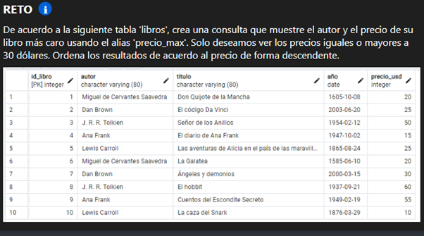
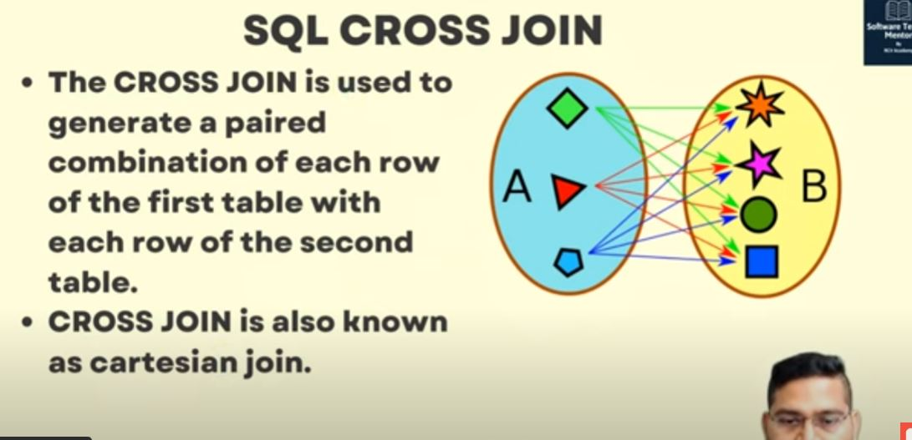

## **SELECT**
> Seleccionamos simplemente un texto. 
```sql
SELECT 'Hoola'
```

> Seleccionando un texto colocando nombre a la columna. 

```sql
SELECT 'Hola' AS Saludo;
```

> Selecionando todo el contenido de un archivo .sql
```sql
SELECT * FROM "paises";
-- Esto es igual a:

SELECT * FROM paises;
```

> Selecionamos solo un acolumna o varias columnas de un archivo .sql

```sql
SELECT iso FROM paises;
-- Selecionar varias columnas: 
SELECT iso, nombre FROM paises;
-- Colocamos diferente nombres a las columnas:
SELECT iso AS otroNombreIso, nombre AS Nombre2 FROM paises;
```

> Selecionamos todo el contenido de un archiv .sql y lo ordenamos de segun la columna _codigo_ de manera desendiente y acendiente. 

```sql 
-- Decendiente
SELECT * FROM paises ORDER BY codigo DESC;
-- Ascediente: 
SELECT * FROM paises ORDER BY codigo ASC;
```

## **INSERT**

> Isertar datos a una tabla

```sql
INSERT INTO usuarios (id, nombre, apellido) VALUES (1000, 'Misael', 'Ramirez')
```

# **NOTA**
```sql
-- Si nosotros evitamos establecer los nombres de cada, estableceremos que estamos agregando todos. 
INSERT INTO usuarios VALUES (1000, 'Misael', 'Ramirez', 24)
```
## **UPDATE**

> Modificar una tabla.

```sql
UPDATE usuarios 
	SET
		usuario = 'Ingeniero Full Stack',
		edad = 25,
		pais = NULL
	WHERE id = 1000;
```

## ELIMINATED

> Borrar un dato dato de una tabla 

```sql
DELETE FROM usuarios WHERE id > 1000
-- Se pueden utilizar diferentes condicionales o rango s de datos. 
```

## **CREAR UNA TABLA**

> Crear una tabla

```sql
CREATE TABLE IF NOT EXISTS libros (
    id int NOT NULL,
    autor varchar(255) DEFAULT NULL,
    titulo varchar(50) DEFAULT NULL,
    año int,
    precio int,
    PRIMARY KEY (id) 
);
```
## **COUNT()**
> Consultar cuantos datos hay en toda la tabla. 

```sql
SELECT COUNT(*) FROM paises
```

> Consultar cuantos datos hay haciendo uso de condiciones. 

```sql 
SELECT COUNT(*) FROM usuarios WHERE nombre = 'david' AND apellido = 'john' 
```
## **LIMIT & OFFSET**
> Realizar una paginacion para una pagina web 
```sql
SELECT id, nombre, apellido FROM usuarios WHERE nombre = 'david' ORDER BY apellido DESC LIMIT 3 OFFSET 6; 
-- ORDER BY -> INDICA COMO SE VA A ORDENAR
-- DESC -> INDICA UN DESPLIEGE DESENDENTE
-- LIMIT -> DESPLIEGA UN LIMITE DE DATOS
-- OFFSET -> CUANDO SE ESTABLECE UN LIMIT, PARTICIONES DE LOS DATOS Y EL OFFSET INDICA QUE PARTICION SE OBTENDRA. 
```

## **FILTRAR**
> Filtrar por medio de IS
```sql
SELECT * FROM paises
    WHERE iso3 = 'AFG'
    OR iso3 IS NULL
    ORDER BY  codigo DESC;
-- Cuando el valor del file de un scort es NULL y queremos seleccionarlo, se utiliza IS en este caso
```
> Filtrar por medio de LIKE
```sql
SELECT * FROM paises
    WHERE legible LIKE '%t_nia';
-- %t_nia -> el valor de % indica cualquier cantidad de caracteres antes de t_nia. Ahora `_` significa que cualquier caracter que este en ese espacio. Para este caso, seleccionara elementos de que contengan legible = 'Estonia' o 'Mauritania'
```

> Filtrar por meido de IN
```sql
SELECT * FROM paises
    WHERE legible IN ('Ecuador', 'Mexico')
-- En este ejemplo, se selecciona todos los scorts que contengas legible = 'Ecuador' o 'Mexico'
-- En vez de utilizar legible = 'Mexico' OR legible = 'Ecuador' se utiliza IN para evitar escribir legible varias veces. 
```

# **NOTA:**
**Se podria decir que una instruccion de sql esta escrita en varias etapas. la primera etapa es seleccionar las columnas a selecionar, lo segundo es seleccionar uque files o datos vamos a seleccionar filtrando por medio de WHERE, posteriormente se ordena usando ORDER BY y ASC o DESC. Ahora si se quisera usar un paginacion se usa LIMIT & OFFSET

## **EXPRESIONES CONDICIONALES**

> Crear una expresion condicional:
```sql
SELECT legible,
    CASE -- El condicional se abre despues de poner "," con la palabra CASE y despues END
        WHEN legible = 'Argentina' THEN 'che' -- Primera condicion
        WHEN legible = 'Mexico' THEN 'guey' -- Segunda condicion 
        ELSE 'pana' -- Valor default
    END AS dude -- Estamos re asignando el nombre de la columna nueva
FROM paises; -- De que archivo .sql
```

## **OPERADORES NUMERICOS**

> Realizar operaciones numericas
```sql
SELECT 1 + 2; -- 3
SELECT 2 * 2; --4
SELECT 1 / 2; --0
SELECT 1.2 / 2; --0.6000000
SELECT 1.2::float / 2; -- Al momento de definir que el numero de arriba es flotante el resultado estara mas simplificado, osea 0.6
SELECT 1::float / 2; -- Si establecemos que el numero de arriba en flotante, el resultado sera flotante, osea 0.5
SELECT 5 / 2; -- Nos dara la parte entera del flotante, osea 2.
SELECT 5 % 2; -- En este caso, nos brinda el modulo o residuo, osea 1
SELECT 5::float / 2; -- En este caso nos devuleve 2.5
```
SQL ofrece mucho operadores y la documentacion se encuentra en: https://www.postgresql.org/docs/9.3/functions-math.html

## **DISTINTOS**
> Vamos a remover duplicados en nuestra lista. 
```sql
SELECT DISTINCT nombre, apellido FROM usuarios WHERE nombre = 'david';
-- La palabra DISCTINCT va a buscar todas las combinaciones repetidas de nombre y apellido (en este caso). Esto quiere decir que los datos deplegados seran los que contengan el nombre = 'david' y eliminara unicamente de mostrar las combinaciones repetidas de nombre y apellido. 
```

> Vamos a solicitar usuarios con el mismo nombre sin impotar si estan escritos en minusculas o mayusculas o variado. 

```sql 
SELECT * FROM usauarios WHERE LOWER(name) = LOWER('sonia')
-- Nos va a devolver varios datos que contengan la columna nombre = 'Sonia' o 'sonia' o incluso 'SONIA' etc
```

> Vamos hace rlo mismo que lo anterior pero sin tener que establecer LOWER(). Esto se hace definiendo el tipo de dato al inicio de crear la tabla. Ejemplo:

```sql 
CREATE TABLE ejemplo (
    id serial PRIMARY KEY,
    nombre citext
);
```

## **ORDENAR**
> Ordenamos la solicitu de los datos de acuerdo a un parametro y si el valor de ese parametro es igual en varios daotos, se ordena de acuerdo a la siguinte opcion.

```sql
SELECT * FROM paises ORDER BY codigo, legible DESC;
```

## **Tipos**
> Se utliza: 
1. int
2. varchar()
3. float

## **Texto**

> Poniendo una comilla en un texto 

```sql
SELECT 'Hello '' World'
```

> Uniendo dos texto: 

```sql
SELECT 'Hello' || 'World'
-- Otra forma: (Aveces sirve con algunos sistemas, aveces no. )
SELECT CONCAT('Hello', 'World')
```

> Obtener el length de un string:

```sql
SELECT LENGTH('Hello World')
```

> Eliminar los espacion al inicio o al final de un texto:  

```sql
SELECT TRIM('    HELLO WORLD')
```

> Cambiar un texto a mayusculas:

```sql
SELECT UPPER('hello World')
```

> Cambiar todo a minusculas:

```sql
SELECT LOWER('HELLO World')
```

> Obtener una parte de un texto: 

```sql
SELECT SUBSTR('HELLO WORLD',2,2) --Este comando indica que se obtendra 2 caracteres empezando desde el indice 2, donde 
--'HELLO WORL D'
-- 1234567891011
```

> Obtener los nombres y una columna con con la longitud de cada nombre:
```sql
SELECT nombre, LENGTH(nombre) FROM usuarios
```

## **TRIM**

> Eliminar solo los espacion de la izquierda:

```sql
SELECT LTRIM('  HELLO WORLD  ');
```
> Eliminar solo los espacios de la derecha:
```sql
SELECT RTRIM('  HELLO WORLD  ');
```
> Eliminar del texto el caracter establecido
```sql
SELECT TRIM('---HELLO WORLD---','-');
```

## **UTILIZANDO UPPER**

> Aplicando UPPER en una comparacion:

```sql
SELECT UPPER('hello World') = UPPER('HELLO WORLD')
-- Rretornara true
```

## **Numeros**

Numero maximo de un int -> 2147483647

## **Round**
> Redondear un numero decimal a entero:
```sql
SELECT ROUND(3.5349554);
-- LA SALIDA ES 3
```

> Redondear un numero decimal a entero con 2 cifras decimales:
```sql
SELECT ROUND(3.5349554, 2);
-- LA SALIDA ES 3.53
```

## **Booleands**
> Presentacion de booleand: 

```sql
 SELECT true;
 SELECT false;
 SELECT true AND true;
 SELECT false OR true;
 SELECT 1=1;
```

> Compuertas o comparadores:
```sql
 SELECT true AND true;
 SELECT false OR true;
 SELECT 1=1;
```

## **Date y Time**
> stablecer una fecha: 
```sql
SELECT date '2001-10-05'
```

> Establecer fecha actual:
```sql
SELECT date 'now';
```
> Establecer la hora;
```sql
SELECT time 'now';
```

> Establecer la fecha y la hora
```sql
-- Codigo que nos dara la fecha y la hora en 00:00:00 al no ser establecida
SELECT timestamp '2001-10-05';
-- Ahora con los dos:
SELECT timestamp '2001-10-05 02:23:34';
-- Ahora, veremos la fecha de hoy y la hora de hoy:
SELECT timestamp 'now';
```

> Establecer la fecha y la hora colocando la zona horaria: 
```sql
SELECT timestamp with time zone 'now'
```

> Guardar mi tiempo local como si fuera UTC
```sql
SELECT timestamp 'now' at time zone 'utc'
```

> Cambiar la zona horaria de todo mi sistema: 
```sql
SET timezone TO 'utc';
```

> Volver a mi zona horaria anterior: 
```sql
timezone TO 'gmt+7';
```

## **Funcion PG_TYPEOF**
> Obtener que tipo de dato es:
```sql
SELECT PG_TYPEOF(100);
SELECT PG_TYPEOF(100.34);
SELECT PG_TYPEOF('TEXTO');
-- En el ejemplo anterior nos arrojara unnown por que en realidad no sabe que tipo de texto es ese. Por lo tanto se define lo siguiente:
SELECT PG_TYPEOF('TEXTO'::text);
```
## **AGRUPAR**
> Agrupamos todos los elementos y los contamos. 
```sql
SELECT COUNT(*) FROM usuarios;
```

> Agrgupar por paises y contar cuantos hay ahi. Seleccionamos los paises y en grupos, ademas agregamos una columna que nos indique la cantidad de elementos que contengan este valor, osea ese pais:
```sql
SELECT paises, COUNT(*) FROM usuarios GROUP BY paises;
```

> Desplegamos las columnas pais y la cantidad de elementos ordenados y nombramos esa segunda columna con el numero "numero", de usuarios.sql. Y los desplegamos en orden de acuerdo al numero de forma descendiente. 
```sql
SELECT pais, COUNT(*) AS numero FROM usuarios GROUP BY paises ORDER BY numero DESC
```

> Filtrar los datos obtenidos anteriormente por medio de having:
```sql
SELECT pais, COUNT(*) AS numero FROM usuarios GROUP BY paises HAVING COUNT(*) >= 15 ORDER BY numero DESC
```
> Reto:



## **Funciones agregadas**
Pueden utilizarse en la agrupacion de varios elementos y asi mostrar otra columna con el resultado de la operacion para cada grupo: 
Primero empezamos con las operaciones (funciones):

> Sacar el promedio de varios valores segun eld ato que proporcionemos
```sql
SELECT AVG(edad) FROM usuarios;
```

> Obtener el valor minimo de varios datos segun la variable que proporcionemos.
```sql
SELECT MIN(edad) FROM usuarios;
```

> Obtener el valor maximo de varios datos segun la variable que proporcionemos.
```sql
SELECT MAX(edad) FROM usuarios;
```

> Obtener la suma de todos los valores de alguna variable (columna)
```sql
SELECT SUM(edad) FROM usuarios;
```

Posteirormente, aplicamos las operaciones a un grupo de datos:
> Ordenar por pais y mostrar el conteo total de cada grupo. 
```sql
SELECT pais, COUNT(*) FROM usuarios GROUP BY pais;
```

> Ordenar la consulta por pais y mostrar el promedio de que tiene cada persona por ese pais. 
```sql
SELECT pais, AVG(edad) FROM usuarios GROUP BY pais; 
```

Más funciones agregadas aquí:
https://www.postgresql.org/docs/13/functions-aggregate.html

## **Agrupar Distintos**
Procedimeinto:
> Primero obtenemos solo los elementos una vez sin que se repitan, esto sin tener que AGRUPARLOS:
```sql
SELECT DISTINCT(pais) FROM usuarios;
```
> Obtener la cantidad de elementos distintos 
```sql
SELECT COUNT(DISTINCT(pais)) FROM usuarios;
```

## **Manejar con tablas**
> Crear una tabla basica:
```sql
CREATE TABLE escribientes (
    nombre varchar(20),
    apellido varchar(20),
    edad int
);

INSERT INTO escribientes VALUES 
('Julio','Ramirez', 48),
('Misael', 'Ramirez', 25);

SELECT * FROM escribientes;
```
> El comando NOT NULL nos ayuda a evitar no ingresar un valor a la tabla, debido a qu enos arroja error si no se ingresa un valor requerido: 
```sql
CREATE TABLE IF NOT EXISTS escribientes(
    id int NOT NULL,
    nombre TEXT NOT NULL,
    edad INT NOT NULL,
    PRIMARY KEY (id)
);
-- Si despues de crear la tabla ingresamos el siguiente valor nos arroja un error
INSERT INTO escribientes (edad, nombre) VALUES (25, 'Jennifer Lopez');
-- La manera correcta es ingresando todos los valores
INSERT INTO escribientes (id, nombre, edad) VALUES (3, 'Jenifer Lopez', 23);
```

> Borrar una tabla: 
```sql
DROP TABLE escribientes;
```
> Borrar una tabla si es que existe, para que noo muestre ningun error:
```sql
DROP TABLE IF EXISTS escribientes;
```
> Insertar un nuevo elemento con valores predeterminados:
```sql
INSERT INTO escribientes DEFAULT VALUES;
-- En este caso, los valores predeterminados seran NULL
```
> Copiar valores de una tabla a otra: 
```sql
INSERT INTO prueba (numero, texto) SELECT id, usuario FROM usuarios;
```

> Crear restricicones en la creacin de una tabla: 
```sql
CREATE TABLE IF NOT EXISTS familia (
    id int UNIQUE NOT NULL,
    numero int DEFAULT 10,
    texto text NOT NULL
);
-- La palabra UNIQUE nos indica que sera un valor unico, exepto si ingresamos el valor NULL, lo cual Postgresql no lo identifica como un valor a NULL
-- DEFAULT: nos indica que si no se ingresa un valor el valor por defecto es 10
-- 
```
La documentación oficial muestra más restricciones que puedes indicar en tu esquema:
https://www.postgresql.org/docs/13/ddl-constraints.html

> Como modificar una tabla modificando la creacion de la tabla: 
```sql
ALTER TABLE prueba ADD buleano bool; -- Aqui se agrega una columna de nombre buleano que acepta datos booleanos.
ALTER TABLE prueba ADD texto2 text DEFAULT 'TextoPredetemrinado'; -- Aqui se agrega una nueva columna de nombre texto2 con un valor determinado de 'TextoPredeterminado'
ALTER TABLE prueba ALTER COLUMN texto2 TYPE varchar; -- Aqui modificamos la columna de una tabla. Cambiamos su tipo de dato.
ALTER TABLE prueba DROP COLUMN buleano, DROP COLUMN IF EXISTS texto2; -- Aqui eliminamos una columna de la tabla. Tambien es bueno saber que la coma indica que podemos hacer varias modificaciones a la vez, incluso utilizar IF EXISTS por si es que si existe no arreoje ningun error el programa. 

```

> Asignar una clave primaria en la creacion de una tabla: 
```sql
CREATE TABLE IF NOT EXISTS prueba (
    id SERIAL PRIMARY KEY, -- La palabra secuencia nos permite asigna de forma secuencial un numero que al tene rtambien la palabara PRIMARY KEY sera la llave principal.
    texto text

);

INSERT INTO prueba (texto) VALUES ('veinte');
INSERT INTO prueba (id, texto) VALUES (34, 'catorce');
```

## **UNiones**
Existen 4 tipos de uniones:
1. inner Join 
2. left Join
3. Rigth JOIN
4. Full Join
5. Cross Join

> Ejemplos de los Joins
```sql
-- Inner Join:
SELECT p.nombre, u.usuario FROM productos AS p INNER JOIN usuarios AS u ON p.usuario_id = u.id;

-- Left Join:
SELECT p.nombre, u.usuario FROM productos AS p LEFT JOIN usuarios AS u ON p.usuario_id = u.id;

-- RIGHT JOIN:
SELECT p.nombre, u.usuario FROM productos AS p RIGHT JOIN usuarios AS u ON p.usuario_id = u.id;

-- FULL JOIN:
SELECT p.nombre, u.usuario FROM productos AS p FULL JOIN usuarios AS u ON p.usuario_id = u.id;
```

> Hacer un ejemplo practico: 
```sql
SELECT * FROM ventas AS v
	INNER JOIN productos AS p ON v.producto_id = p.id
	INNER JOIN usuarios AS u ON v.usuario_id = u.id;

-- Primer se coloca la tabla secundaria y hasta el final la primaria. 
-- Ambos tienen que tener relacion con la tabla secundaria, en este caso ventas que es la que esta anidada a usuarios y venta, por eso mismo se usaron los iguales como se muestra en el ejemplo. 
```

> Ejemplo de un cross Join


```sql
-- Primera froma de hacer un cross Join: 
SELECT * FROM emails e1, emails e2; -- Nota: Tenemos si o si generar un nombre diferente para que no ocurra ningun error. 

-- Segunda froma:
SELECT * FROM emails e1 CROSS JOIN emails e2;
```

## **Transacciones**
Las transsacciones nos aseguran realizar todas las operaciones (consultas, updates, etc) de un proceso. 

> Transaccionar dinero de un cuenta a otra: 
```sql
CREATE TABLE IF NOT EXISTS cuentas (
    id SERIAL UNIQUE PRIMARY KEY,
    name varchar(50),
    balance int
);

INSERT INTO cuentas (name, balance) VALUES
(Jeff Bezos, 1002),
(Elon Musk, 1001),
(Bill Gates, 1000);

-- Las transsacciones se incian con un BEGIN; y se terminan con un COMMIT; esas palabras solo plican para postgresql
BEGIN;
UPDATE cuentas SET
    balance = balance - 100
    WHERE name = 'Elon Musk';
UPDATE cuentas SET
    balance = balance + 100
    WHERE name = 'Bill Gates';
COMMIT;
```

**Concurrencias**
Otra razon para usar transacciones son por las concurrencias:
Esto evita que se manifiesten concurrencias, ya que todo lo que este dentro de una transaccion se llevara acabo instruccion por instruccion. 

**Rendimeinto**
Otra razon para tener transacciones es el rendimiento. Cuando agrupamos varias instrucciones en una transaccion va hacer mucho mas rapido realzizar actualizaiciones en la tabla, ya uq ecada vez que hay una trasacciones uno debe acceder a la memoria. 
Ahora para qu elas transaccione no la shaga de manera automatica descativamos la opcion de transaccion automatica yendo a file/preferences/QueryTools/options y desactivamos. 
SIempre se recomienda prender las autotrasaciones para que no haya problema. 

**Revertir**
Podemos revertir una trasanccion usando reversiones
> Revertir una operacion: 
```sql
CREATE TABLE IF NOT EXISTS cuentas (
    id SERIAL UNIQUE PRIMARY KEY,
    name varchar(50),
    balance int
);

INSERT INTO cuentas (name, balance) VALUES
('Jeff Bezos', 1002),
('Elon Musk', 1001),
('Bill Gates', 1000);

SELECT * FROM cuentas;

DROP TABLE cuentas;

BEGIN;
UPDATE cuentas SET
	balance = balance - 100
	WHERE name = 'Jeff Bezos';
SAVEPOINT pagoAElon;
UPDATE cuentas SET
    balance = balance + 100
    WHERE name = 'Elon Musk';
ROLLBACK TO pagoAElon;
UPDATE cuentas SET
    balance = balance + 100
    WHERE name = 'Bill Gates';
COMMIT;
```

## **Gatillos (triggers)**
Estos gatillos son como funcione sy cuando hay varios evetnos se disparan las funciones. 
La auditoria nos sirven para registrar quien hizo las modificaciones de una tabla.

> Crear una auditoria para la tabla de empleados.
```sql
CREATE TABLE IF NOT EXISTS uditoria_empleados (
    operacion char(1) NOT NULL, -- Que operacion se realizo (CRUD)
    momento timestamp NOT NULL, -- En que momento se llevo acabo 
    usuario text NOT NULL, -- usuario: persona que hizo este cambio
    empleado text NOT NULL, -- Aqui se guardan los datos del empleado de los datos que fue cambiado
    salario integer 
);
```


## **Creacion de un proyecto**
> Creando un abase de datos. 
```sql
CREATE DATABASE nombreDeLaBaseDeDatos;
```

> Creando un tipo de dato, en ese caso, utilizando ENUM
```sql
CREATE TYPE plazo AS ENUM ('dia', 'semana', 'mes', 'año');

CREATE TABLE metas (
    id SERIAL PRIMARY KEY,
    udsuario_id int NOT NULL,
    detalles text NOT NULL,
    plazo plazo NOT NULL,
    icono text,
    meta int, fecha_limite timestamptz
);
```

> Tenemos que saber con exactitud como trabjaar con el numero hash y la sal. 
> Otro tipo d edato es timestamptz


FALTA TEMRINAR DE VER EL CAPITULO 10 DE COMPLEMENTOS!!!! 

FACEBOOK
Cuentas
--------------------------------------------------------------
id usuario      nombre  apellido    hash        sal     edad 
1  MichDroid    Misael  Ramirez     hswjsnxd    hswhs   25      